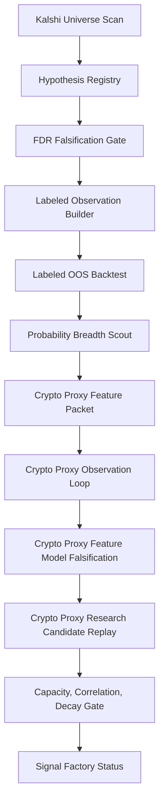

# Kalshi Signal Factory Architecture

The signal factory is the north-star pipeline that keeps research honest: universe
inventory is not an edge, softness is not a signal, and positive EV rows are not
deployable until the falsification, capacity, correlation, sizing, execution-control,
and decay loops exist.

## Pipeline Overview



Each stage produces a JSON/Markdown artifact under `docs/codex/macro/`. The
status report (`kalshi-signal-factory-status-latest/`) reads all upstream
artifacts and reports the current next-gap and routing decision.

## Stage Descriptions

### 1. Kalshi Universe Scan

Scans the public Kalshi universe into a candidate inventory with close-time
windows, filtering for actionable contract types.

```bash
make kalshi-universe-scan
make kalshi-universe-watch-once   # safe one-shot for timer/manual use
```

- **Artifact**: `docs/codex/macro/latest-kalshi-universe-scan.json`
- **Gate**: Must produce candidates in the configured close-time window before
  downstream stages can proceed.

### 2. Hypothesis Registry

Generates versioned, unvalidated hypotheses from the universe scan. Each
hypothesis is tagged with a multiple-testing family for FDR control.

```bash
make kalshi-hypothesis-registry
```

- **Artifact**: `docs/codex/macro/latest-kalshi-hypothesis-registry.json`
- **Gate**: Requires safe universe scan. Hypothesis count must be > 0.

### 3. FDR Falsification Gate

Tests registered hypotheses with FDR (False Discovery Rate) control. This is the
first gate that distinguishes a real signal from noise.

```bash
make kalshi-labeled-oos-backtest
```

- **Artifact**: `docs/codex/macro/latest-kalshi-falsification-gate.json`
- **Gate**: Status must not start with `falsification_gate_blocked`.

### 4. Labeled Observation Builder

Builds pending/settled out-of-sample label packets from public Kalshi
settlements and locally tracked observations.

```bash
make kalshi-labeled-observation-builder
make kalshi-labeled-observation-watch-once   # fetch settlements + build
```

- **Artifact**: `docs/codex/macro/latest-kalshi-labeled-observation-builder.json`
- **Gate**: Status transitions from `pending_observations_waiting_settlement`
  to `label_rows_ready` as settlements arrive.

### 5. Labeled OOS Backtest

Runs labeled out-of-sample hypothesis falsification against accumulated
observations. Requires minimum observation and OOS counts.

```bash
make kalshi-labeled-oos-backtest
```

- **Artifact**: `docs/codex/macro/latest-kalshi-labeled-oos-backtest.json`
- **Gate**: Requires >= 30 total observations and >= 10 OOS observations.

### 6. Probability Breadth Scout

Scouts fast-settling probability-source routes (crypto, weather) to find
candidates where proxy data is available for feature construction.

```bash
make kalshi-probability-breadth-scout
make kalshi-probability-breadth-watch-once
```

- **Artifact**: `docs/codex/macro/latest-kalshi-probability-breadth-scout.json`
- **Gate**: Status must reach `probability_breadth_scout_ready_crypto_proxy_feature_route`.

### 7. Crypto Proxy Feature Packet

Builds contract-keyed crypto proxy feature packets from universe scan data and
locally captured proxy observations.

```bash
make kalshi-crypto-proxy-feature-packet
make kalshi-crypto-proxy-feature-watch-once   # universe + breadth + feature
```

- **Artifact**: `docs/codex/macro/latest-kalshi-crypto-proxy-feature-packet.json`
- **Gate**: Status must reach `crypto_proxy_feature_packet_ready`.

### 8. Crypto Proxy Observation Loop

Archives crypto proxy observations and settled labels on a recurring basis.
Observations accumulate until enough labels are settled for model falsification.

```bash
make kalshi-crypto-proxy-observation-loop
make kalshi-crypto-proxy-observation-watch-once
```

- **Artifact**: `docs/codex/macro/latest-kalshi-crypto-proxy-observation-loop.json`
- **Gate**: Status transitions through:
  - `ready_waiting_settlement` (accumulating observations)
  - `observations_recorded_waiting_settlement`
  - `label_rows_ready` (enough settled labels to proceed)

### 9. Crypto Proxy Feature Model Falsification

Falsifies crypto proxy feature families against settled labels. Uses independent
contract labels and a test fraction split for OOS evaluation.

```bash
make kalshi-crypto-proxy-feature-model-falsification
```

- **Artifact**: `docs/codex/macro/latest-kalshi-crypto-proxy-feature-model-falsification.json`
- **Gate**: Requires >= 30 independent labels and >= 10 OOS labels. Status must
  reach `ready_with_research_candidates` for replay.

### 10. Crypto Proxy Research Candidate Replay

Replays surviving research candidates against all-in cost gates using the
falsified model. Positive cost-adjusted rows are candidates for paper overlay.

```bash
make kalshi-crypto-proxy-research-candidate-replay
```

- **Artifact**: `docs/codex/macro/latest-kalshi-crypto-proxy-research-candidate-replay.json`
- **Gate**: Status transitions:
  - `blocked_predeployment_gates` (capacity/correlation/decay gates not met)
  - `ready_no_positive_cost_adjusted_rows` (model survives, but no positive EV after costs)
  - `ready_for_paper_probability_overlay` (candidates survive all gates)

### 11. Capacity, Correlation, Decay Gate

Gates replay candidates on order-book depth, within-venue correlation clusters,
and signal decay across time-to-close buckets.

```bash
make kalshi-crypto-proxy-capacity-correlation-decay
```

- **Artifact**: `docs/codex/macro/latest-kalshi-crypto-proxy-capacity-correlation-decay.json`

### Signal Factory Status

The status report reads all upstream artifacts and reports the current
next-gap and routing decision. Run after each stage completes:

```bash
make kalshi-signal-factory-status
```

- **Artifact**: `docs/codex/macro/kalshi-signal-factory-status-latest/`

## Full Observation Watch-Once

Run the complete pipeline end-to-end (universe through status):

```bash
make kalshi-crypto-proxy-observation-watch-once
```

This chains: universe scan, probability breadth, feature packet, observation
loop, model falsification, candidate replay, capacity/correlation/decay,
signal factory status, and macro routing.

## Not Yet Built

The following capabilities are tracked in the status report but are not yet
implemented:

- **Capacity model**: Ghost-listing-adjusted capacity (liquidity/price-impact)
- **Correlation model**: Within-venue correlation for shared games/events/macro
- **Fractional Kelly sizing policy**: Intentionally disabled until falsification,
  capacity, and correlation gates exist
- **Execution control plane**: No account/order path until sizing and kill-switch
  gates are audited
- **Realized P&L / signal-decay retirement loop**

These remain `blocked` in the status report until built.
